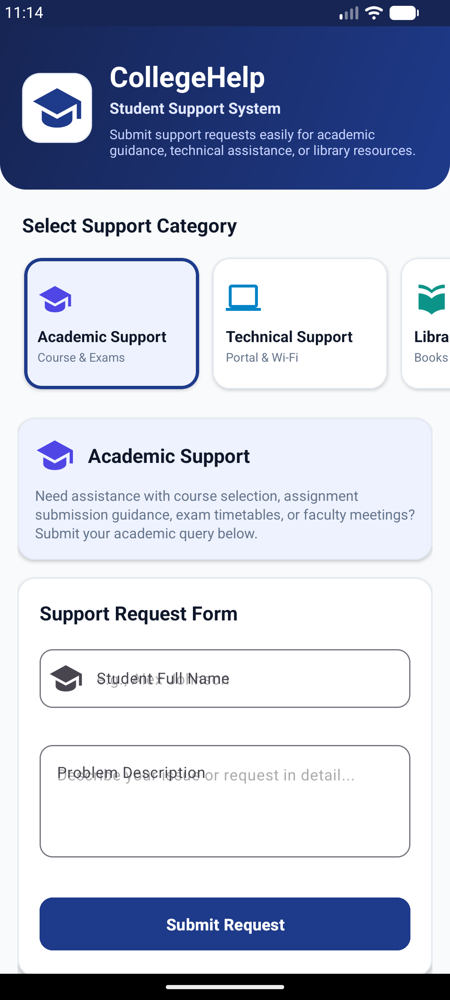
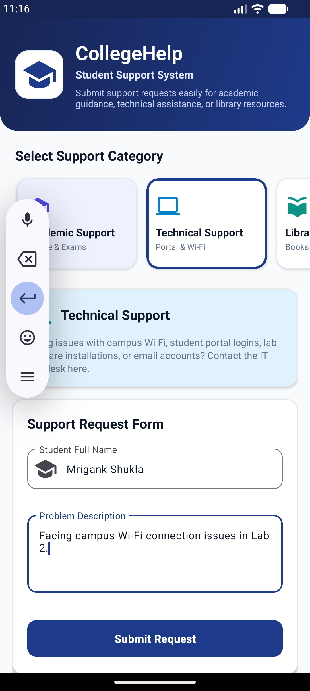
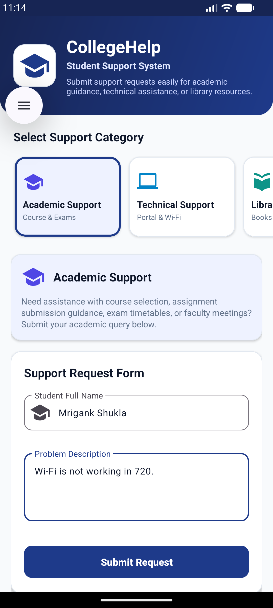

# CA1-CollegeHelp – Student Support 🎓

A modern, functional, and clean Android application built for a college student-support system. The app allows students to submit support requests across **Academic Support**, **Technical Support**, and **Library Support** categories.

---

## 📱 App Screenshots

| 1. Home Screen | 2. Category & Form | 3. Request Confirmation |
| :---: | :---: | :---: |
|  |  |  |

---

## 🚀 Key Features & Requirements Demonstrated

1. **Activity – Fragment Communication & Navigation**:
   - `HomeActivity` manages category card selections and dynamically loads/replaces the reusable `SupportCategoryFragment`.
2. **Activity – Activity Navigation & Intent Data Transfer**:
   - `SupportCategoryFragment` validates student input and launches `ConfirmationActivity` using `Intent` extras (`studentName`, `category`, `problemDesc`).
3. **Input Validation**:
   - Prevents empty submissions with real-time error messages on `TextInputLayout` fields.
4. **Android Notifications**:
   - Automatically posts a system notification upon request submission with full Android 13+ (`POST_NOTIFICATIONS`) permission handling.
5. **Activity & Fragment Lifecycle Demonstration**:
   - Logs lifecycle callbacks (`onCreate`, `onStart`, `onResume`, `onPause`, `onStop`, `onDestroy`, etc.) under the unified Logcat tag: **`CollegeHelp`**.
6. **Modern Material Design UI**:
   - Styled with Material 3 components, rounded cards, custom vector icons, elevation, custom color palettes, and clear typography.

---

## 🔄 Navigation & Application Flow

```
HomeActivity (Select Support Category)
      │
      ▼
SupportCategoryFragment (Category Guidelines & Support Request Form)
      │
      ▼ (Validates Form & Triggers Intent)
ConfirmationActivity (Display Ticket Summary & Generates System Notification)
      │
      ▼ (Return Home Button)
HomeActivity
```

---

## 📁 Project Structure

```
CA1-CollegeHelp-Student Support/
├── build.gradle                          # Root Gradle build configuration
├── settings.gradle                       # Subproject inclusions
├── gradle.properties                     # JVM and Android build options
├── local.properties                      # SDK configuration
├── gradlew & gradlew.bat                 # Gradle wrapper scripts
├── screenshots/                          # App screenshots for documentation
│   ├── 01_home_screen.png
│   ├── 02_category_selection.png
│   └── 03_confirmation_screen.png
└── app/
    ├── build.gradle                      # App module dependencies & ViewBinding
    ├── proguard-rules.pro
    └── src/
        └── main/
            ├── AndroidManifest.xml       # Activity registrations & permissions
            ├── java/com/collegehelp/studentsupport/
            │   ├── HomeActivity.kt                  # Main launcher activity
            │   ├── SupportCategoryFragment.kt       # Reusable category & form fragment
            │   ├── ConfirmationActivity.kt          # Submission confirmation screen
            │   ├── NotificationHelper.kt            # Notification channel & posting utility
            │   └── models/
            │       └── SupportCategory.kt           # Enum for support categories
            └── res/
                ├── drawable/                        # Custom vector icons & backgrounds
                │   ├── ic_college_logo.xml
                │   ├── ic_academic.xml
                │   ├── ic_technical.xml
                │   ├── ic_library.xml
                │   ├── ic_confirmation_check.xml
                │   ├── ic_notification.xml
                │   └── bg_header_gradient.xml
                ├── layout/                          # UI layout XMLs
                │   ├── activity_home.xml
                │   ├── fragment_support_category.xml
                │   └── activity_confirmation.xml
                ├── values/                          # App branding & resources
                │   ├── colors.xml
                │   ├── strings.xml
                │   ├── themes.xml
                │   └── dimens.xml
                └── values-night/
                    └── themes.xml
```

---

## 📋 Component Descriptions

### 1. `HomeActivity.kt`
- Prominent header with college logo and app description.
- Three horizontal category cards: **Academic Support**, **Technical Support**, and **Library Support**.
- Updates category selection styling dynamically and manages `SupportCategoryFragment` transactions.
- Logs lifecycle callbacks (`onCreate`, `onStart`, `onResume`, `onPause`, `onStop`, `onDestroy`).

### 2. `SupportCategoryFragment.kt`
- Receives category identifier via `Bundle` arguments.
- Displays category-specific guidelines, custom icons, and theme accents.
- Contains the Support Request Form (`Student Name` and multi-line `Problem Description`).
- Validates user input and launches `ConfirmationActivity` via `Intent`.
- Logs complete Fragment lifecycle (`onAttach`, `onCreate`, `onCreateView`, `onViewCreated`, `onStart`, `onResume`, `onPause`, `onStop`, `onDestroyView`, `onDestroy`, `onDetach`).

### 3. `ConfirmationActivity.kt`
- Extracts submitted details from `Intent` extras.
- Displays a success badge, random ticket reference ID (`#REQ-XXXX`), student name, category, and issue summary.
- Triggers system notification using `NotificationHelper`.
- Provides a **Return Home** button that clears the top activity stack and returns to `HomeActivity`.
- Logs lifecycle callbacks.

### 4. `NotificationHelper.kt`
- Creates the notification channel `college_help_channel` for Android 8.0+.
- Posts a system notification confirming submission.
- Handles Android 13+ (`POST_NOTIFICATIONS`) runtime permission checks.

---

## 📝 Logcat Lifecycle Output Example

Filter Logcat by TAG: **`CollegeHelp`** during execution:

```log
D/CollegeHelp: HomeActivity: onCreate
D/CollegeHelp: HomeActivity: Category selected -> ACADEMIC
D/CollegeHelp: SupportCategoryFragment: onAttach
D/CollegeHelp: SupportCategoryFragment: onCreate
D/CollegeHelp: SupportCategoryFragment: onCreateView
D/CollegeHelp: SupportCategoryFragment: onViewCreated
D/CollegeHelp: SupportCategoryFragment: onStart
D/CollegeHelp: HomeActivity: onStart
D/CollegeHelp: HomeActivity: onResume
D/CollegeHelp: SupportCategoryFragment: onResume
D/CollegeHelp: SupportCategoryFragment: Form submitted by Alex Johnson for Technical Support
D/CollegeHelp: ConfirmationActivity: onCreate
D/CollegeHelp: ConfirmationActivity: onStart
D/CollegeHelp: ConfirmationActivity: onResume
```

---

## 🛠️ How to Build & Run

1. Open Android Studio.
2. Select **Open an existing project** and choose `CA1-CollegeHelp-Student Support`.
3. Allow Gradle to sync dependencies.
4. Select an emulator or connected device (Target SDK 34, Min SDK 24).
5. Click **Run (`Shift + F10`)**.
