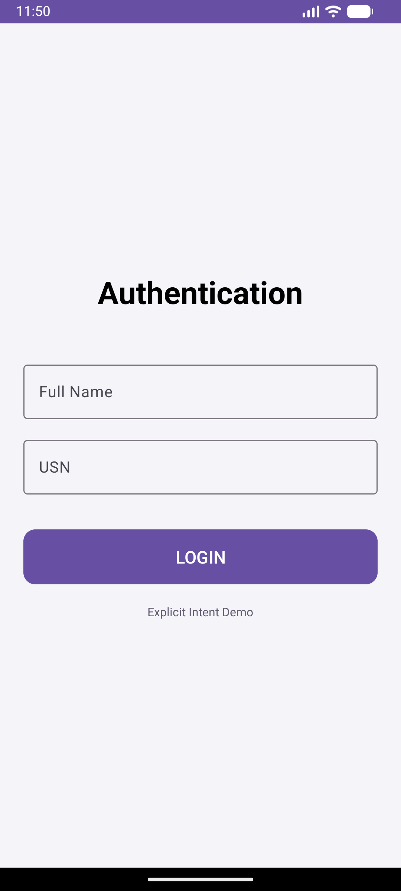
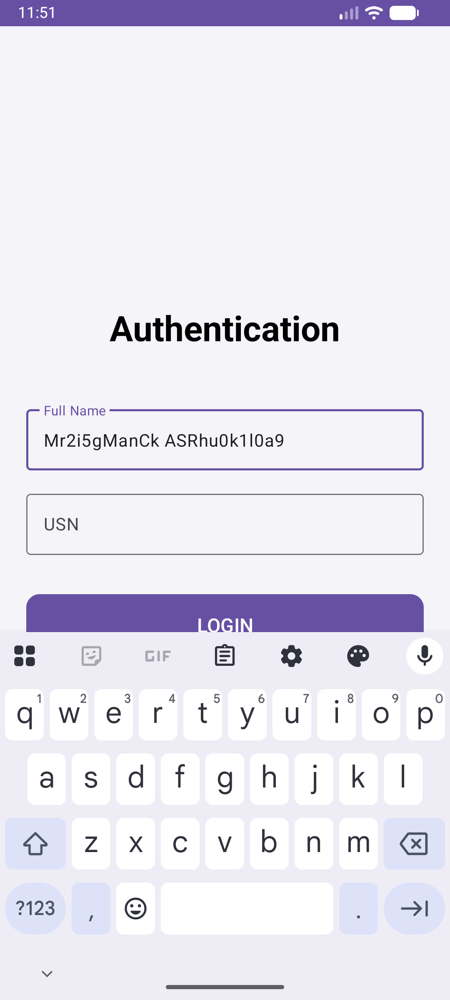
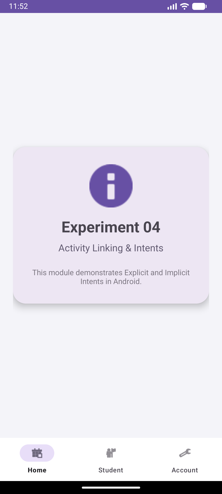

# Experiment 04: Activity Linking & Intents

## Overview
This experiment demonstrates how to link different activities within an Android application using **Explicit Intents** and how to interact with external system applications using **Implicit Intents**.

## Concept & Technology
- **Explicit Intents:** Used to start a specific component (e.g., navigating from `LoginActivity` to `DashboardActivity` while passing user data).
- **Implicit Intents:** Used to request an action from any app that can handle it (e.g., opening a URL in a browser, dialing a phone number, sharing text, or viewing a location on a map).
- **Modern UI (Material 3):** Polished user interface with `TextInputLayout`, `MaterialButton`, and `MaterialCardView`.
- **Fragments:** Modular UI design with a `BottomNavigationView`.

## Scenario
1. **Authentication:** Uses an **Explicit Intent** to move from Login to Dashboard, passing the student's Name and USN.
2. **Intent Lab:** Located in the "Student" tab, it provides buttons to trigger various **Implicit Intents**:
   - **Open GitHub:** Launches the system browser.
   - **Dial Number:** Opens the phone dialer.
   - **Share Info:** Opens the system share sheet.
   - **View Map:** Opens the map application.

## Demo Video
The following video demonstrates internal navigation and external application linking.

<video src="demo_exp4.mp4" width="320" height="640" controls></video>

*If the video above doesn't load, you can [view it directly here](demo_exp4.mp4).*

## Screenshots

### 1. Modern Authentication (Explicit Intent Entry)

### 2. Dashboard Hub

### 3. Intent Lab (Implicit Intent Actions)

---
**Developer:** Mrigank Shukla  
**USN:** 25MCAR0109
