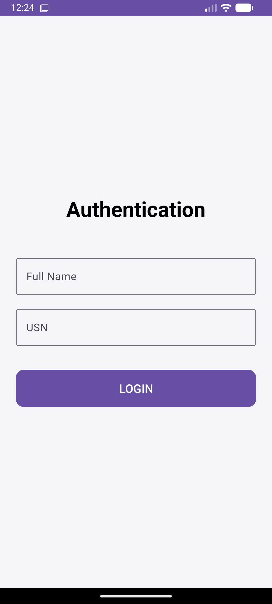
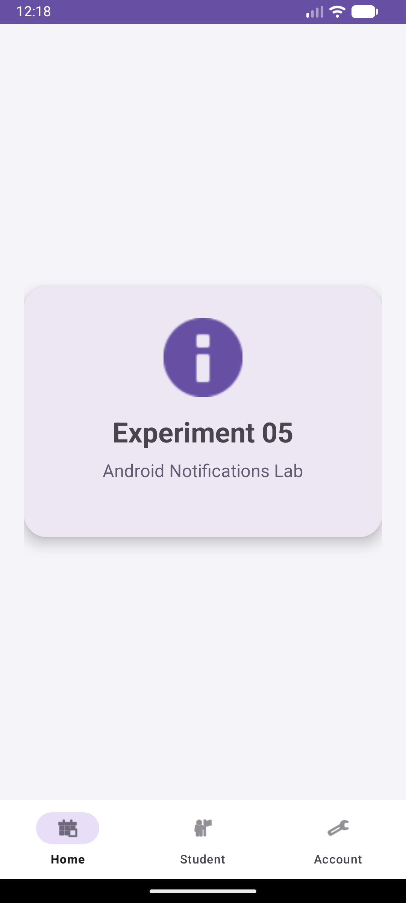
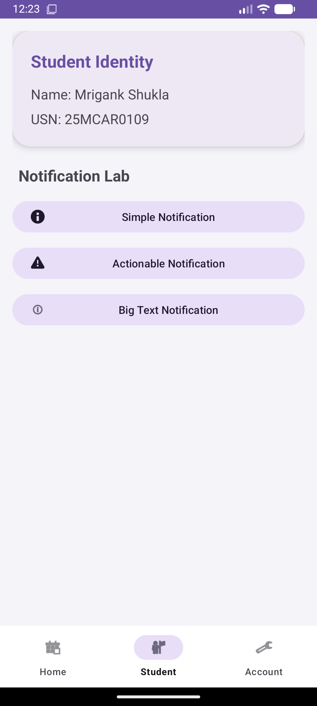

# Experiment 05: Android Notifications Lab

## Overview
This experiment focuses on implementing a robust notification system in Android. It demonstrates how to create notification channels, handle permissions (Android 13+), and display various types of notifications including simple, actionable, and styled (Big Text) notifications.

## Concept & Technology
- **Notification Channels:** Categorizing notifications for user control (mandatory for API 26+).
- **POST_NOTIFICATIONS Permission:** Runtime permission handling for modern Android versions.
- **Pending Intents:** Enabling user interaction with notifications to open specific activities.
- **Notification Styles:** Using `BigTextStyle` for detailed message display.
- **Material 3 UI:** Polished interface for triggering notification events.

## Scenario
1. **Authentication:** Modern Login screen for identity verification.
2. **Dashboard:** Centralized hub using Fragments.
3. **Notification Lab:** A dedicated screen in the "Student" tab to trigger:
   - **Simple Notification:** Shows Student Name and USN.
   - **Actionable Notification:** Includes an "Open App" button to return to the Dashboard.
   - **Big Text Notification:** Demonstrates expanded text layout for longer content.

## Demo Video
The following video shows the permission request flow and the display of different notification types in the system tray.

<video src="demo_exp5.mp4" width="320" height="640" controls></video>

*If the video above doesn't load, you can [view it directly here](demo_exp5.mp4).*

## Screenshots

### 1. Modern Authentication

### 2. Notification Permission Request
The app handles runtime permissions for Android 13+.

### 3. Notification Tray
Demonstrating multiple notification types with student identity (**Name: Mrigank Shukla | USN: 25MCAR0109**).

---
**Developer:** Mrigank Shukla  
**USN:** 25MCAR0109
