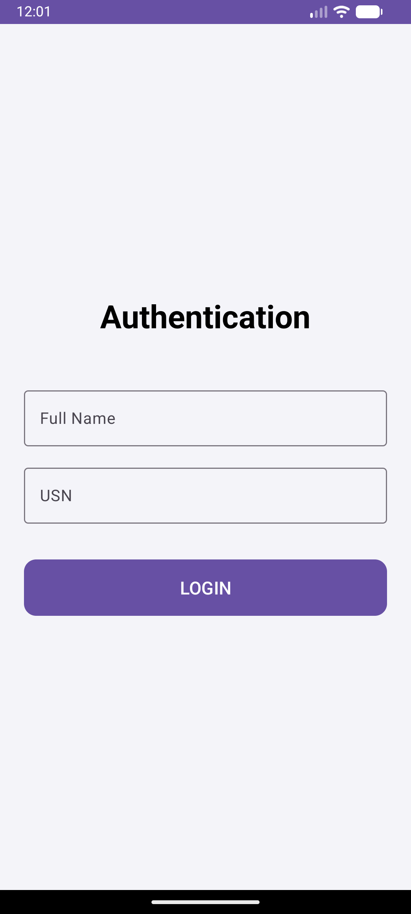
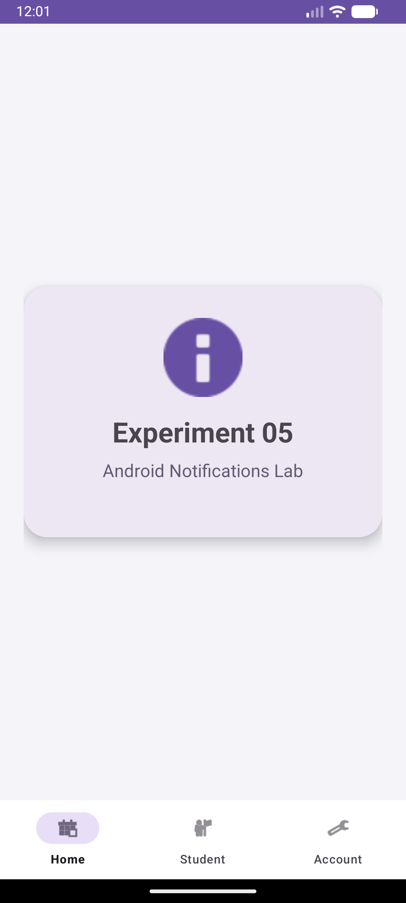
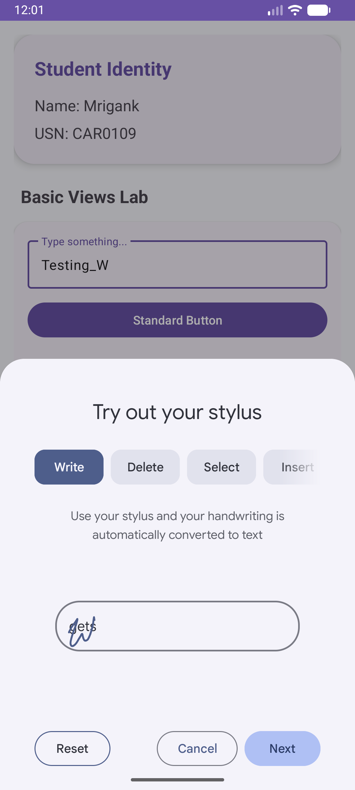

# Experiment 06: Basic Android Views Lab

## Overview
This experiment focuses on implementing and understanding basic Android UI components. It demonstrates the usage of various views to create an interactive form and handle user input effectively.

## Concept & Technology
- **Core Views:** Implementation of `TextView`, `EditText`, `Button`, and `ImageButton`.
- **Selection Widgets:** Using `CheckBox`, `ToggleButton`, `RadioButton`, and `RadioGroup` for capturing user preferences.
- **Event Handling:** Attaching click and checked change listeners to widgets for real-time feedback.
- **Material 3 Design:** Using Material components for a consistent and modern look.
- **Fragments:** Modular UI organization using a single-activity architecture.

## Scenario
1. **Authentication:** A Material 3 login screen with `TextInputLayout`.
2. **Dashboard:** A central hub showing navigation options.
3. **Basic Views Lab:** A dedicated screen in the "Student" tab that showcases all implemented widgets within an elevated `MaterialCardView`. Interacting with any widget triggers a `Toast` message with specific feedback.

## Test Cases & Screenshots

### 1. Modern Authentication Page
User entry point for identity verification.

### 2. Dashboard (Home)
The landing fragment after successful login.

### 3. Basic Views Showcase
Demonstration of all core widgets including inputs, toggles, and radio selections.

---
**Developer:** Mrigank Shukla  
**USN:** 25MCAR0109
