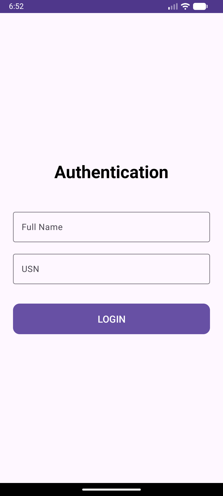
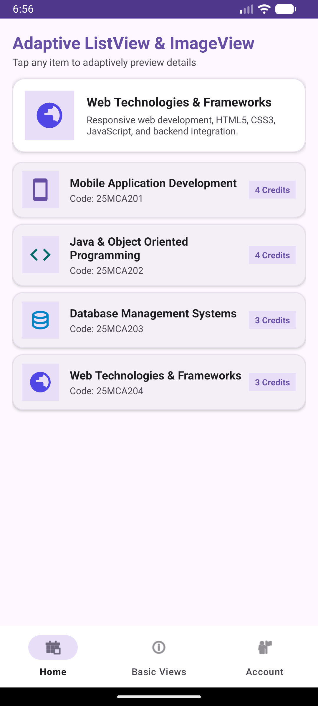
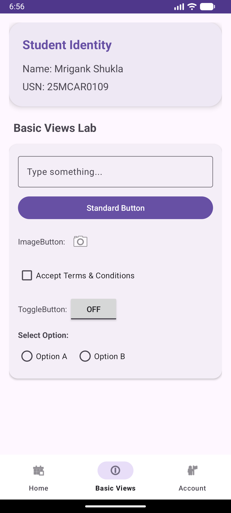

# Experiment 07: Creating an Adaptive Android Application with ListView and ImageView

## Overview
This experiment builds upon **Experiment 06** by extending the student dashboard application into an **Adaptive Android Application**. It demonstrates the usage of `ListView` with a custom `ArrayAdapter` (`CourseAdapter`) and `ImageView` components to display an interactive list of course modules with dynamic previewing and orientation-adaptive UI layouts.

## Key Concepts & Implementation
- **Custom ListView & Adapter**: Implemented `CourseAdapter` to populate a `ListView` using custom item row layouts (`item_course_list.xml`) containing `ImageView` icons, course titles, course codes, and credit status badges.
- **Adaptive UI Architecture**:
  - **Portrait Mode (`layout/fragment_home.xml`)**: Features a top detail card with an `ImageView` header that adaptively updates when any item in the `ListView` below is tapped.
  - **Landscape Mode (`layout-land/fragment_home.xml`)**: Adaptively adjusts into a dual-column master-detail split layout where the `ListView` is presented on the left and a large `ImageView` detail card is on the right.
- **Base Views & Authentication (from Exp 06)**: Retains the Material 3 Login screen (`TextInputLayout`, `MaterialButton`) and Basic Views Showcase (`CheckBox`, `ToggleButton`, `RadioGroup`, `ImageButton`).

## Test Cases & Screenshots

### 1. Authentication Page
Material 3 login entry point verifying student credentials.

### 2. Adaptive ListView & ImageView Dashboard
Interactive `ListView` populating course modules with `ImageView` icons and real-time detail preview card.

### 3. Basic Views Showcase
Demonstration of core input widgets, toggles, and radio selections.

---
**Developer:** Mrigank Shukla  
**USN:** 25MCAR0109
