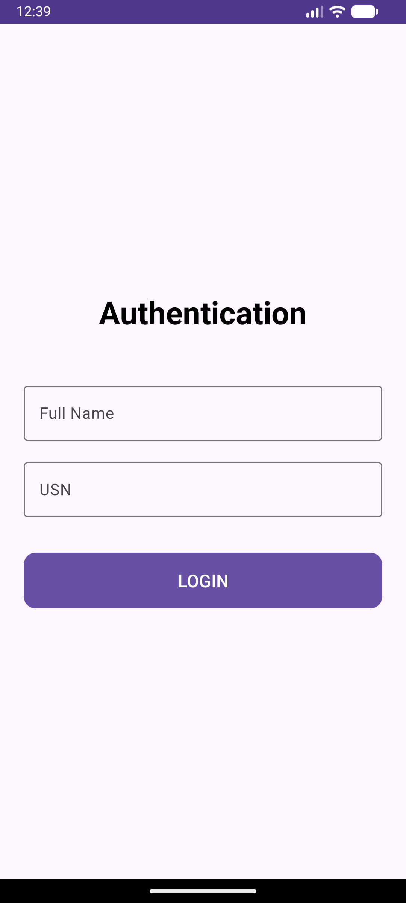
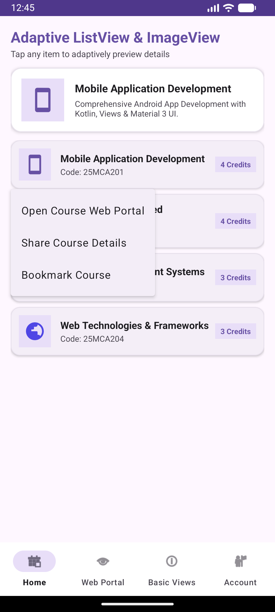
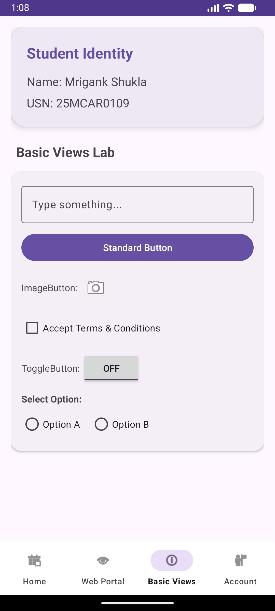

# Experiment 08: Implementing Menus and WebView in an Android Application

## Overview
This experiment builds upon **Experiment 07** by adding support for **Android Menus** (Options Menu & PopupMenu) and an embedded **WebView** browser portal. It demonstrates rendering web content inside an Android app with navigation controls, progress indicators, and interactive menu selections.

## Key Concepts & Implementation
- **WebView Integration**:
  - Implemented `WebViewFragment` featuring `WebView`, `WebViewClient` (for in-app navigation), and `WebChromeClient` (for page load progress).
  - Configured `WebSettings` with `javaScriptEnabled = true`, `domStorageEnabled = true`, and zoom controls.
  - Added URL navigation controls: Back, Forward, Refresh, URL entry bar, and GO button.
- **Android Menus**:
  - **Options Menu (`main_options_menu.xml`)**: Provides top-level actions including Refresh Page, Open in External Browser, Clear Web Cache, and About.
  - **PopupMenu (`context_popup_menu.xml`)**: Triggered when a course row is tapped in the `ListView` (`HomeFragment`), offering options to "Open Course Web Portal", "Share Course Details", and "Bookmark Course".
- **Adaptive ListView & Base Views (from Exp 07 & Exp 06)**: Retains adaptive `ListView` with `CourseAdapter`, custom row layouts, and Material 3 basic views showcase.

## Test Cases & Screenshots

### 1. Authentication Page
Material 3 login entry point verifying student credentials.

### 2. ListView & PopupMenu Demonstration
Adaptive course list where tapping any course displays a `PopupMenu` linking directly to its web portal.

### 3. Embedded WebView Portal
Full-featured in-app browser rendering `https://developer.android.com` with progress bar and navigation toolbar.

### 4. Basic Views Showcase
Demonstration of core input widgets, toggles, and radio selections.

---
**Developer:** Mrigank Shukla  
**USN:** 25MCAR0109
