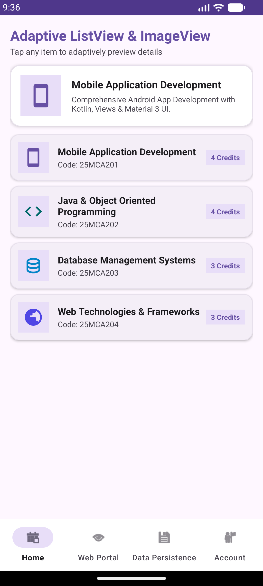
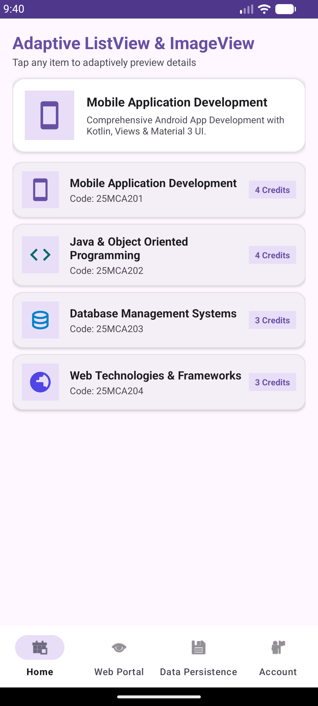
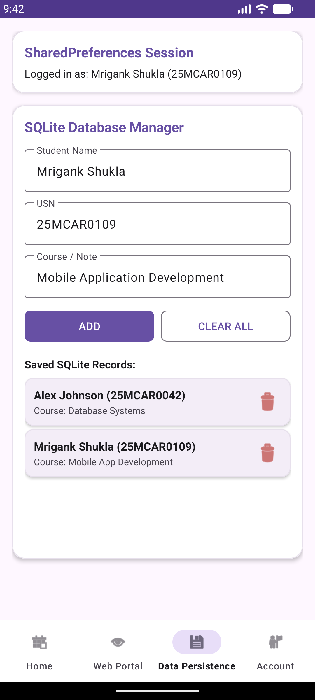
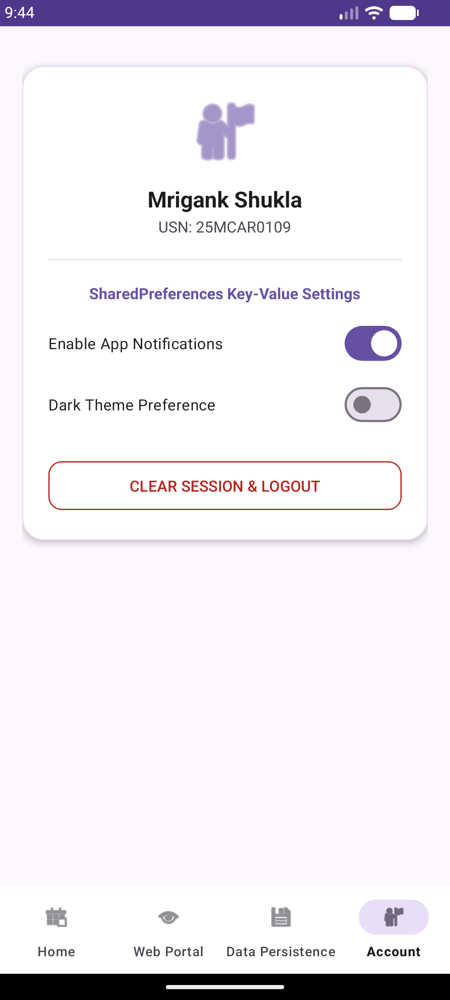

# Experiment 09: Data Persistence using SharedPreferences and SQLite Database

## Overview
This experiment extends **Experiment 08** by implementing two fundamental Android **Data Persistence** mechanisms:
1. **SharedPreferences** for storing key-value pairs (user session credentials, app preferences, notification settings).
2. **SQLite Database** (`SQLiteOpenHelper`) for managing structured relational data with full **CRUD** (Create, Read, Update, Delete) operations.

## Key Concepts & Implementation

### 1. Key-Value Storage with SharedPreferences (`PreferenceManager.kt`)
- Manages user authentication state (`isLoggedIn`), student credentials (`userName`, `userUsn`), and UI preferences (`notificationsEnabled`, `darkModeEnabled`).
- Auto-logs in users when valid session credentials exist in `SharedPreferences`.
- Provides toggles in `AccountFragment` to dynamically save user settings and clear sessions.

### 2. Relational Database with SQLite (`DatabaseHelper.kt`)
- Extends `SQLiteOpenHelper` to create and manage table `student_records` (`id`, `name`, `usn`, `course`).
- Implements full CRUD operations:
  - **Create (`insertRecord`)**: Adds new student/course entries directly from the form or bookmarked courses.
  - **Read (`getAllRecords`)**: Queries all entries from SQLite database and displays them in a custom `ListView` (`SqliteRecordAdapter`).
  - **Delete (`deleteRecord` & `deleteAllRecords`)**: Removes specific entries via row delete buttons or clears the entire table.

### 3. Integrated Structure (from Exp 08)
- Retains Material 3 Login (`LoginActivity.kt`), Adaptive ListView & ImageView (`HomeFragment.kt`), PopupMenu options, and Embedded WebView Portal (`WebViewFragment.kt`).

## Test Cases & Screenshots

### 1. Authentication Page
Session persisted in `SharedPreferences` upon login.

### 2. Adaptive ListView & PopupMenu
Course catalog with PopupMenu option to save bookmarks directly to the **SQLite Database**.

### 3. SQLite Database & SharedPreferences Persistence
Data Persistence tab showing active `SharedPreferences` session info alongside SQLite Database CRUD controls and record list.

### 4. Account Settings & SharedPreferences
Account fragment displaying user details and key-value preference toggles.

---
**Developer:** Mrigank Shukla  
**USN:** 25MCAR0109
